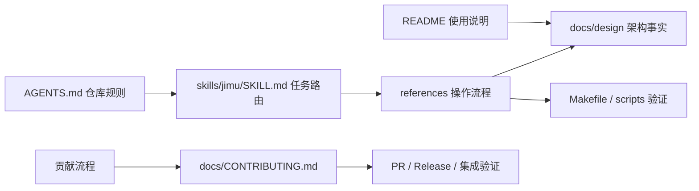

# 工程协作工作流设计

> 本文属于仓库工程协作设计，描述规则和文档如何被维护；它不是 Jimu 服务的运行时架构设计。

## 背景与范围

仓库规则、使用说明、操作步骤和架构事实由不同受众使用。把这些内容平行复制到 README、Agent 配置和 skill references 中，会让规则在后续修改时逐渐不一致。

本文定义协作文档的职责和链接关系，不替代各文件中的完整规则或操作步骤。版本分支、PR、发布及集成验证流程以贡献指南为准。

### 设计目标与非目标

设计目标：

- 长期协作约束有单一入口。
- Agent 操作流程可按任务选择，并链接到架构事实。
- README 面向使用者和开发者，避免重复完整设计边界。

非目标：在设计文档复制完整的项目指令、skill 操作步骤或 release checklist。

## 设计方案

| 文档/入口 | 主要职责 | 不承担的内容 |
|---|---|---|
| `AGENTS.md` | 仓库长期协作规则、保护工作区与项目约束 | 每种操作的完整步骤 |
| `skills/jimu/SKILL.md` 与 references | 按任务路由到可执行工作流和验证命令 | 架构事实的平行副本 |
| `README.md` | 安装、配置、CLI、API 和常用开发操作 | 详细的内部设计推导 |
| `docs/design/` | 稳定的当前职责边界、流程和不变量 | 阶段计划、历史讨论和可派生清单 |
| `docs/CONTRIBUTING.md` | 分支、PR、发布和集成验证 | 能力运行时架构 |

- `AGENTS.md` 是仓库协作规范和长期约束的入口；`CLAUDE.md` 是指向它的软链接。
- `skills/jimu/SKILL.md` 是 jimu skill 的事实源，概述仓库边界并索引到 `references/` 下的操作流程。skill 由 `make skills-install` 链接到 Agent 发现目录。
- `README.md` 面向使用者和开发者，保留安装、配置、CLI、API 与常用命令；稳定设计说明链接到 `docs/design/`。
- `docs/CONTRIBUTING.md` 记录分支、PR、发布和集成验证流程；`docs/releases/` 保存版本日志，并作为 GitHub Release 正文来源。

常见阅读顺序是先读取 `AGENTS.md`，再根据任务读取匹配的 skill reference；要了解稳定架构边界时阅读对应设计文档，要执行贡献和发布流程时阅读贡献指南。

任务执行时先读取 `AGENTS.md`。若任务命中 jimu skill 的范围，再读 skill 入口和对应 reference；reference 给出操作步骤并链接 README、设计文档和门禁。变更结束时，按改动种类同步用户文档、设计事实或 release 记录，并运行相关门禁。

## 关键决策

- **`AGENTS.md` 是仓库通用规则入口。** Agent 先读取全局协作约束，再按任务加载 skill 的具体操作流程。
- **`skills/` 是可版本控制的事实源。** 工具发现目录通过安装脚本链接生成，避免维护多份 skill 副本。
- **README 与设计文档分工。** README 保留使用说明、参数和操作步骤；稳定架构边界由 `docs/design/` 说明。
- **贡献流程集中在贡献指南。** 发布、分支和集成验证不混入架构设计文档或 skill 的通用边界说明。
- **目录区分稳定事实与工作记录。** `docs/design/` 维护稳定架构事实，`docs/superpowers/specs/` 和 `docs/superpowers/plans/` 保存特定工作的方案与执行记录；工作记录不作为当前实现的权威描述。

## 约束与不变量

- `skills/` 是可版本控制的事实源；`.claude/` 和 `.agents/` 是工具发现目录，不作为本仓 skill 内容的副本维护。
- README 提供概览和使用入口，不复制设计文档中的完整边界描述；skill reference 记录如何操作和验证，并链接到设计与贡献文档。
- 架构或职责边界改变时更新对应 `docs/design/` 文档；安装方式、操作步骤和贡献流程改变时更新相应入口，并运行相关文档门禁。
- 项目内 skill 修改应同时校验 frontmatter、reference 引用与路径；`make check-skills` 校验 skill 结构，不验证正文与设计事实是否一致，内容一致性仍需 review。

## 实现映射

- 仓库规范：[AGENTS.md](../../AGENTS.md)
- Skill 事实源：[skills/jimu](../../skills/jimu/SKILL.md)
- 安装与校验：[Makefile](../../Makefile)、[脚本目录](../../scripts)
- 使用和贡献说明：[README.md](../../README.md)、[docs/CONTRIBUTING.md](../CONTRIBUTING.md)
- 验证：`make check-skills`；分支、PR 和发布流程依照 [docs/CONTRIBUTING.md](../CONTRIBUTING.md)
