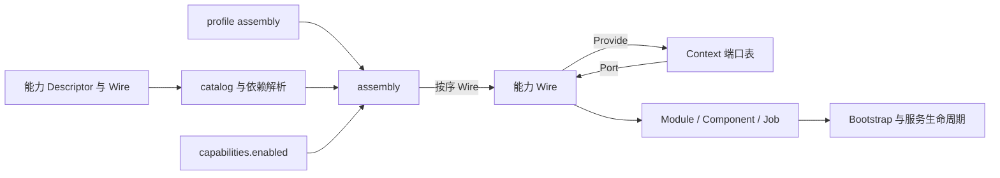

# 能力架构设计

## 背景与范围

Jimu 将后端按可组合的能力组织。能力需要独立声明依赖和资源归属，并由不同 profile 组合进入服务构建；能力之间还要保持明确的调用边界，避免可插拔只停留在目录拆分。

本文定义能力声明、组合和协作的稳定规则。具体能力清单、profile 成员和门禁结果由代码与工具派生，不在本文维护易漂移的总数或重复清单。

### 设计目标与非目标

设计目标：

- 每项能力通过统一描述符声明依赖、资源和集成点。
- profile 决定哪些能力代码进入服务构建，运行配置只筛选已编入的能力。
- 能力间通过稳定 contract 端口协作，组合根负责实例装配。

非目标：运行时动态加载插件、把每项能力拆成独立 Go module，或由组合根维护第二份能力元数据。

## 设计方案

### 组成部分

| 部分 | 职责 | 实现入口 |
|---|---|---|
| 能力包 | 实现单一业务或技术职责，并提供静态描述和装配入口 | [`internal/capabilities`](../../internal/capabilities) |
| `contract` | 定义能力描述、模块生命周期和能力间端口 | [`internal/contract`](../../internal/contract) |
| `catalog` | 汇总参与能力解析的正式能力描述 | [`internal/capabilities/catalog`](../../internal/capabilities/catalog) |
| profile | 声明进入某个服务构建的能力、驱动与装配顺序 | [`internal/profiles`](../../internal/profiles) |
| `assembly` | 解析 profile 和运行配置，注入端口并启动应用 | [`internal/assembly`](../../internal/assembly) |

能力根包导出静态 `Descriptor` 与 `Wire(*assembly.Context)`。能力有生命周期行为时，`Wire` 返回 `contract.Module`；只提供端口或迁移的能力可以返回 `nil`。描述字段由 [`contract.Descriptor`](../../internal/contract/capability.go) 定义，包括依赖、表所有权、配置段、权限点、路由挂载方式、迁移、驱动和非代码资产。

### 依赖与协作

- `Requires` 是硬依赖，解析能力集时会补齐依赖闭包；`SoftRequires` 是可选协作，缺少提供方时由消费能力降级。
- 能力只能通过 `internal/contract` 中的端口协作。能力内部的实现、测试和驱动不得直接导入其他能力的内部包。
- `catalog` 集中导入需要登记的能力根包；profile assembly 组合实际构建的一组能力。内核提供共享机制，不反向依赖具体能力。
- `assembly` 按解析后的能力顺序调用 `Wire`，并在 `Context` 中提供端口注册与读取；端口消费者只能在提供方已注册后读取。
- `Descriptor.Mount` 声明路由挂载方式，组合根不按能力名特判。

### 组合与运行时筛选

profile 通过 Go import 图决定哪些能力包和符号进入服务二进制。`cmd/server` 只通过 `internal/profiles/active` 选择一个 profile 并调用 `assembly.Run`；工具使用的 profile registry 不进入该服务入口。

运行时的 `capabilities.enabled` 在当前 profile 内筛选可门控的能力，硬依赖会随解析补齐。profile assembly 的 `Ungated` 字段表示该条目不受这个运行时筛选控制；它是装配策略标记，不是另一种能力类型。未进入当前 profile 的代码无法由运行时配置启用。

### 服务启动流程

1. `cmd/server` 从 `profiles/active` 取得唯一 profile assembly。
2. `assembly.Run` 检查 assembly 声明、加载内核配置，并在创建容器前解析实际能力集。
3. 应用按解析集解码各能力声明的配置段，依次应用默认值、普通校验和生产校验。
4. 创建内核容器与 `Context`，按 assembly 顺序调用能力 `Wire`。提供方注册端口后，后续消费者通过 `Port` 读取；无 `Module` 的能力仍可提供端口。
5. 执行 profile seed，随后将模块、组件和任务交给 Bootstrap 注册 HTTP、事件、任务及服务组件。
6. 生命周期组件按注册顺序启动，进程退出或组件报告错误时按反序停止已启动组件。

未知能力、硬依赖不完整、配置错误、Wire 错误或 Bootstrap 错误会使启动失败；创建容器后的失败路径会先释放容器资源。组件启动失败时，应用只停止此前已成功启动的组件。

## 关键决策

- **能力声明集中在 `Descriptor`。** 依赖、配置、迁移、路由等事实由能力根包声明，组合和门禁读取同一来源，避免在多个注册表中维护平行清单。
- **构建期选择与运行时筛选分开。** Go import 图裁剪二进制中的包；运行时配置只在已编入的能力中筛选。profile 控制代码组成，运行开关不承担动态加载职责。
- **组合根不按能力名称分支。** profile 负责选择，catalog 负责描述解析，assembly 负责装配；挂载行为由描述符声明，协作由 contract 端口完成。
- **一个 `Module` 不等于一个完整能力。** 某些能力只提供端口、迁移或其他声明资源；启用集以解析后的描述符为准，生命周期模块列表只是其中有运行实例的部分。
- **顺序保持显式。** profile 清单既参与依赖拓扑约束，也确定 Wire 顺序；提供方必须早于消费者。

## 约束与不变量

配置段、权限点、迁移和装配集等能力事实都从描述符派生。改变描述符契约、依赖解析或组合规则时，应检查 catalog、profiles、assembly、生成器和对应门禁，并同步更新本文。清单、profile 成员和门禁输出保持为代码或工具派生数据，不在本文复写。

端口消费者必须位于提供方之后；缺失端口只能按该 contract 的软依赖语义降级，硬依赖则由解析阶段拒绝。能力实现不得直接 import 其他能力内部包，catalog 是集中声明能力的组合边界例外。受保护路由必须由声明的挂载类型注册，不能绕过统一保护链。

## 实现映射

- 契约：[internal/contract](../../internal/contract) 与 [`contract.Descriptor`](../../internal/contract/capability.go)
- 组合：[internal/capabilities/catalog](../../internal/capabilities/catalog)、[internal/profiles](../../internal/profiles)、[internal/assembly](../../internal/assembly)
- 流程与生命周期：[internal/assembly.Run](../../internal/assembly/assembly.go)、[internal/app.Bootstrap](../../internal/app/bootstrap.go)、[internal/app.Application](../../internal/app/application.go)
- 验证：`make check-capabilities`、`make profiles-check`、`make compose-report-check`
- 相关设计：[身份与租户](identity-and-tenancy.md)、[配置与数据生命周期](configuration-and-data-lifecycle.md)、[形态与项目生成](profiles-and-project-generation.md)
