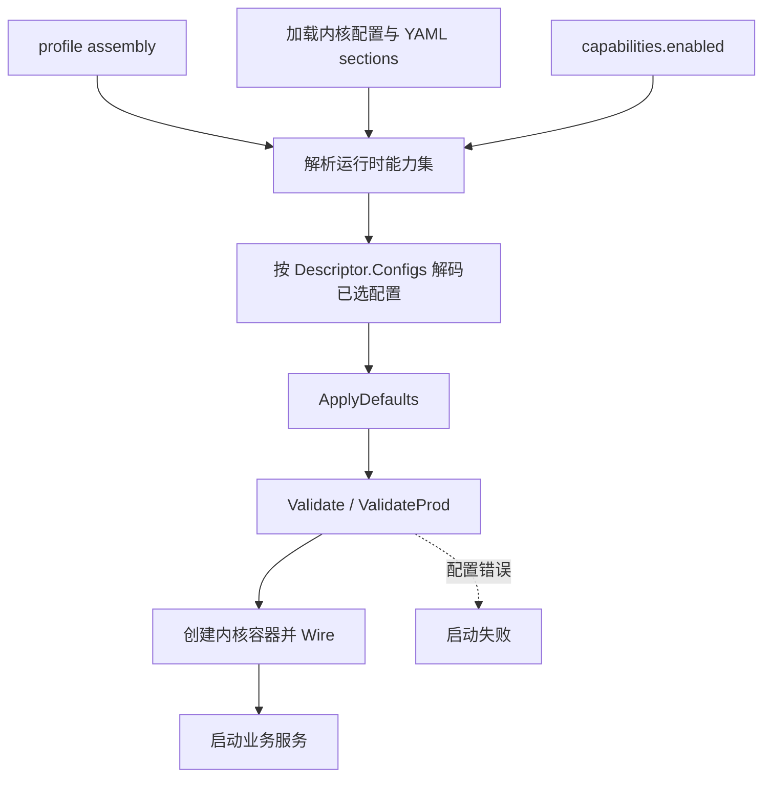
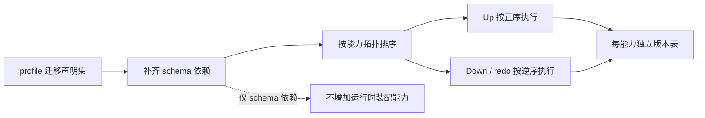

# 配置与数据生命周期设计

## 背景与范围

配置、数据库表、迁移、历史数据清理和字段保护需要跨能力组合。若共享机制同时决定业务配置或清理策略，能力拆分后仍会留下隐式的数据所有者。

本文定义这些资源的所有权如何与能力边界对应。具体 YAML 键、表名和清理策略以能力描述符、配置结构、迁移及任务实现为准。

### 设计目标与非目标

设计目标：

- 配置段和业务数据由声明它们的能力负责。
- schema 迁移可以独立于运行时业务能力集合解析。
- 共享工具提供通用机制，不维护跨能力的数据策略。

非目标：把所有业务配置搬到新的 YAML 顶层，或由共享清理服务集中决定不同能力的数据保留期限。

## 设计方案

### 配置加载流程

### 配置所有权

内核和基础设施配置由 `internal/config` 定义。能力通过 `Descriptor.Configs` 声明自己拥有的配置段，并提供段实例、默认值和校验。组合根先解析当前 profile 的启用集，再按该集合解码能力配置、应用默认值并校验；生产环境还会调用可选的生产校验。未启用能力的配置段不会被解码或校验。

配置段的 YAML 路径可以保持现状，不要求为了代码所有权而移动对外配置键。当前 `auth`、`mfa`、`passkey` 与 `tenant` 分别声明自己负责的配置；例如 WebAuthn 参数属于 `passkey`，可信设备期限属于 `mfa`，开通式注册属于 `tenant`。能力配置变更需重启服务；配置文件热更新目前只应用日志级别。

### 表与迁移

能力在 `Descriptor.Owns` 声明自己负责创建的表，迁移文件由 `Descriptor.Migrations` 提供并嵌入二进制。`Owns` 约束 `CREATE TABLE` 的唯一归属，不表示该能力的所有迁移只能修改自己拥有的表。迁移按 catalog 依赖顺序执行，版本状态按能力分别记录。

迁移集合与运行时装配集合分开解析。profile 的迁移集合可以包含为 schema 完整性所需的额外迁移；这不会把对应业务能力加入运行时装配。迁移边界变化时，同时检查各能力迁移、catalog 的 schema 依赖及 `jimu migrate` 使用的集合。存量库从旧全局版本表迁移到能力版本表时，由 `adopt-capabilities` 登记已有迁移基线，不执行迁移 SQL。

`jimu migrate` 根据选定 profile 构造迁移集合，补上 schema 依赖后按能力拓扑顺序执行；每个能力使用自己的 goose version table。向前迁移按拓扑顺序，回滚按相反顺序。迁移错误带能力名返回；`MigrateWithRetry` 达到配置的重试上限后仍返回错误。

### 种子数据

种子执行位于 app 层，接收当前 profile 的解析能力描述符，不导入具体能力包。能力权限点从这些描述符聚合；默认租户、结构性套餐和平台管理员数据由 app 的结构性 seed 维护。profile seed 在能力 Wire 完成后、Bootstrap 之前运行，失败会阻止服务启动。

### 历史数据清理

[`internal/shared/dbpurge`](../../internal/shared/dbpurge) 只提供调用方指定模型、时间列、过滤条件和批大小的分批删除原语，不拥有表清单，也不注册通用清理任务。清理策略、调度任务和过滤条件由产生数据的能力负责，因此清理规则随该能力装配。

当前审计记录、队列历史、已发布 outbox 事件、已结束导入任务和过期可信设备的清理分别归 `audit`、`queue`、`outbox`、`dataops` 与 `mfa`。不存在独立的 retention 能力；共享原语不能形成跨能力的数据所有权。

### 字段保护

`encryption` 能力通过 GORM hooks 为标记字段提供 AES-GCM 加密和 HMAC 盲索引，支持密文存储及等值查询。密钥由内核安全配置提供；当前实现未配置密钥时会以明文保存这些字段。密码使用不可逆哈希，不经过字段加密流程。全库透明加密属于数据库或部署层责任。

启用加密能力后，它从内核安全配置构造 Cipher 并在 GORM 注册写入加密、读取解密和盲索引 hooks。无密钥时 Cipher 按现行兼容行为退化为明文；因此仅编入能力不代表敏感字段已获得静态加密保护，部署方必须配置有效密钥。

## 关键决策

- **配置键路径与代码所有权分离。** 配置段归属由 `Descriptor.Configs` 表达，对外 YAML 路径可以保持稳定，避免内部模块重组迫使部署配置迁移。
- **迁移集合与运行装配集合分离。** profile 可以为 schema 完整性选择额外迁移，但迁移依赖不会自动引入对应业务路由或用例。
- **清理策略由数据所有者执行。** `dbpurge` 是通用删除原语，不注册统一 retention 作业；这样清理任务随产生数据的能力启停。
- **字段加密作为应用字段保护能力。** GORM hooks、密文与盲索引属于 `encryption`；密钥来源由内核安全配置提供。
- **配置只加载当前启用集。** 未选能力的配置不会被解码，也不会因无关配置错误阻止启动；已选能力配置错误则 fail-fast，避免以不完整配置启动。
- **迁移使用每能力版本表。** 迁移进度和回滚边界与数据所有权对齐；代价是迁移工具必须按能力顺序运行，不能只看一个全局版本号。

## 约束与不变量

改变配置、表或数据生命周期的所有者时，同时检查 `Descriptor.Configs`、`Descriptor.Owns`、迁移声明和对应任务。共享清理工具不能登记所有者以外的表或策略；生成清理任务应随数据所有者一起启停。同一数据库始终使用同一 profile 执行迁移、回滚、重做和存量基线登记，避免按不同迁移集合操作导致版本记录与实际 schema 分离。

清理规则的 `Days <= 0` 表示跳过；执行按有界批次删除，单条规则失败会被收集并返回，不应记录成全部成功。改变 GORM 加密标记或盲索引源字段时，必须同时检查写入、读取、唯一约束和查询路径；密钥轮换与既有密文兼容策略目前不由该能力自动完成。

## 实现映射

- 配置加载：[internal/config](../../internal/config)、[internal/app.LoadCapabilityConfigs](../../internal/app/capconfig.go)
- 表与迁移：[internal/contract.Descriptor](../../internal/contract/capability.go)、[internal/capabilities/catalog](../../internal/capabilities/catalog)
- 种子与迁移执行：[internal/app/seed.go](../../internal/app/seed.go)、[internal/kernel/db/migrate.go](../../internal/kernel/db/migrate.go)、[catalog.MigrationSchemaDeps](../../internal/capabilities/catalog/migration.go)
- 清理与加密：[internal/shared/dbpurge](../../internal/shared/dbpurge)、[internal/capabilities/encryption](../../internal/capabilities/encryption)
- 验证：配置段单测、迁移集/迁移集成测试、各数据所有者清理测试，以及 `make check-capabilities`
- 相关设计：[能力架构](capability-architecture.md)、[身份与租户](identity-and-tenancy.md)
