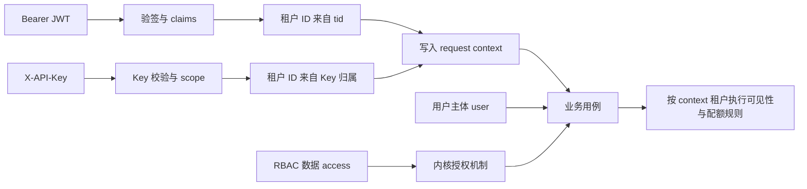

# 身份与租户设计

## 背景与范围

用户主体、认证流程、凭证、访问控制和租户上下文相互协作，但有不同的数据所有者和生命周期。将这些职责混在一个能力中，会让用户管理、认证机制或租户业务无法独立组合。

本文定义身份相关能力与内核机制的边界，以及租户身份进入业务上下文的路径。路由、配置段、表和能力依赖从对应描述符、迁移与 profile assembly 派生，不在本文复制易变清单。

### 设计目标与非目标

设计目标：

- 用户主体与用户账户用例由 `user` 统一拥有。
- 认证、MFA、Passkey、API Key 和 RBAC 数据各自归属明确，并通过 contract 协作。
- 租户上下文只能来自已验证的身份凭证，业务层使用统一的 context 读取入口。

非目标：由内核拥有用户或租户业务数据，或允许请求参数覆盖凭证中的租户归属。

## 设计方案

### 职责归属

| 部分 | 负责内容 |
|---|---|
| `user` | 用户主体、自助账户面和管理面；管理与自助用例共用用户仓储、配额校验及租户可见性 |
| `tenant` | 租户实体、套餐与配额、租户管理和开通式注册 |
| capability `access` | 角色、权限、用户角色分配及其持久化 |
| `auth` | 密码、会话、登录与密码历史及认证流程编排 |
| `mfa` | TOTP 与可信设备 |
| `passkey` | WebAuthn 注册、无密码登录和凭证管理 |
| `apikey` | API Key 签发、校验、撤销和 scope |

能力包与同名内核包属于不同层次：[`internal/kernel/access`](../../internal/kernel/access) 提供 Casbin 强制器、策略加载和权限中间件；[`internal/capabilities/access`](../../internal/capabilities/access) 管理 RBAC 数据和角色分配。`internal/kernel/auth` 提供 JWT、Session、限流和登录失败锁定机制；`internal/capabilities/auth` 实现认证用例。

### 能力间协作

能力间只通过 `internal/contract` 端口协作。`user` 将角色分配委托给 `access`，并可消费 `tenant` 的配额校验；`auth` 可消费 MFA、租户开通、泄露口令检查和验证码校验；`passkey` 通过 `LoginFinalizer` 复用认证能力的登录收尾。端口接口见 [`internal/contract`](../../internal/contract)，提供方由 profile assembly 决定。

### 租户上下文流转

1. JWT 路径先验证 token，再从已验签的 `tid` claim 读取租户身份。
2. API Key 路径先校验 Key，再从 Key 记录读取其租户归属。
3. 对应中间件将租户身份写入请求上下文；业务代码通过 `tenant.FromContext` 读取，不自行解析客户端输入。

缺少租户上下文时，`FromContext` 返回 `0`，用于平台级视角；它与默认租户 ID 是不同概念。

### 用户与认证用例协作

`user` 持有用户主体、自助账户操作和管理操作。`auth` 持有凭证认证与会话用例，登录流程按需消费 MFA、tenant provisioning、breach 与 captcha 端口；`passkey` 持有 WebAuthn 凭证并通过 `LoginFinalizer` 复用 auth 登录收尾。`apikey` 持有 API Key 数据和验证入口。管理用例需要分配角色时，经 contract 委托 `access`，不会直接访问其 repository。

### 租户数据规则

- 用户、角色、审计等业务数据依据各自模型中的租户归属字段隔离；资源可见性由业务仓储或用例根据 context 执行。
- 套餐、配额、用量及租户管理由 `tenant` 持有，消费能力通过 contract 请求校验。
- 固定默认租户用于无归属资源的创建默认值；context 中的 `0` 表示平台级视角，可见范围更宽，不代表默认租户。
- 租户 schema 迁移依赖可能补入迁移集合，但不由此启用租户业务能力。

## 关键决策

- **用户主体与账户用例归 `user`。** 自助面与管理面是同一用户主体的不同用例，共用仓储和配额校验，避免形成两个用户数据所有者。
- **套餐与配额保留在 `tenant`。** 套餐、配额、用量及开通式注册都属于租户业务；内核只提供租户上下文机制。
- **认证与授权机制、业务数据分开。** `kernel/auth`、`kernel/access` 提供请求机制；`capabilities/auth`、`capabilities/access` 持有业务流程和 RBAC 数据。
- **租户身份不接受客户端自由指定。** JWT 和 API Key 分别使用已验证凭证中的租户归属，避免 header/query 成为租户边界的信任来源。
- **内核只负责机制。** 租户 context helper 与默认 ID 常量放在 kernel，租户实体和套餐业务属于 `tenant`；不装配租户管理用例时，其他能力仍能传递和检查租户上下文。
- **`0` 与默认租户分开。** `0` 表示调用上下文没有租户过滤的平台注册视角；默认租户有固定持久化 ID。把二者等同会让平台管理视角和普通默认租户用户共享同一安全语义。

## 约束与不变量

JWT 认证路径从已验签 token 的 `tid` claim 取得租户身份；API Key 路径从已校验 Key 的归属取得租户身份。对应中间件将其写入请求上下文，业务代码通过 [`internal/kernel/tenant`](../../internal/kernel/tenant) 读取。客户端不能通过 header 或 query 参数指定租户身份。

上下文中缺少租户时，`FromContext` 返回 `0`，该值表示平台级视角；默认租户则是独立的固定租户 ID 与编码。默认租户常量和迁移共同定义其身份。租户编码校验与小写归一化集中在内核 tenant 包。

迁移集合与运行时装配集合分开解析。当前 `user` 与 `access` 的模型需要 `tenant_id` 列，迁移集合会为它们带上 tenant schema 迁移；这不会因此装配 tenant 业务能力，也不会挂载租户路由或执行租户业务用例。具体 schema 依赖见 [`catalog.MigrationSchemaDeps`](../../internal/capabilities/catalog/migration.go)。

认证失败或 API Key 校验失败必须在进入业务用例前拒绝请求。租户隔离不得从不可信 header/query 重新计算；新增凭证类型时必须明确它如何建立可信租户 context。平台级 `0` 上下文具备不筛选语义，只能由受信任的内部调用或已定义认证路径产生，不能允许普通客户端通过参数指定。

## 实现映射

- 身份与端口：[internal/capabilities/user](../../internal/capabilities/user)、[internal/capabilities/auth](../../internal/capabilities/auth)、[internal/capabilities/mfa](../../internal/capabilities/mfa)、[internal/capabilities/passkey](../../internal/capabilities/passkey)、[internal/contract](../../internal/contract)
- API Key 认证：[internal/capabilities/apikey](../../internal/capabilities/apikey)
- 租户上下文：[internal/kernel/tenant](../../internal/kernel/tenant)、[JWT 与认证中间件](../../internal/kernel/auth)
- 验证：JWT/API Key 中间件测试、tenant context 测试、能力 import 与声明门禁 `make check-capabilities`
- 相关设计：[能力架构](capability-architecture.md)、[配置与数据生命周期](configuration-and-data-lifecycle.md)
