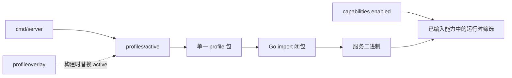
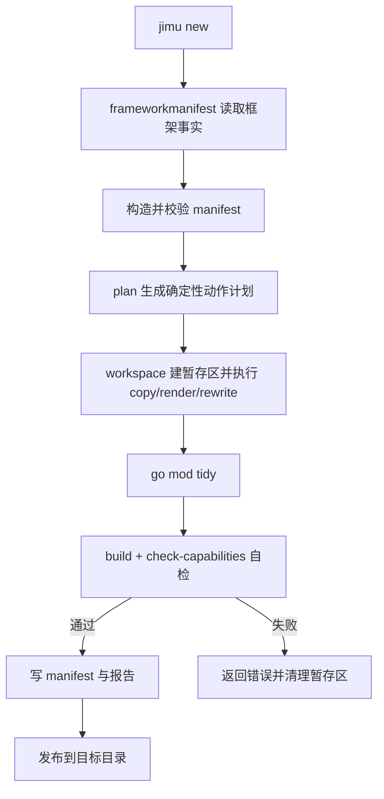
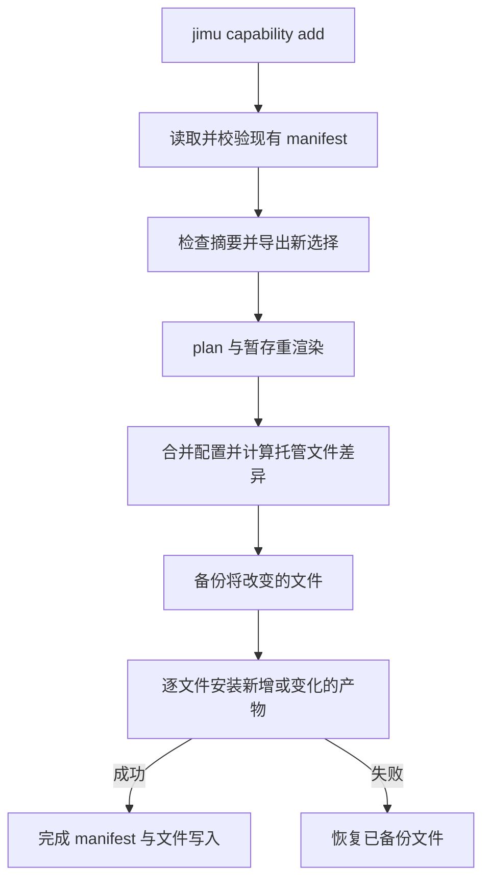

# 形态与项目生成设计

## 背景与范围

Jimu 在服务构建、进程启动和项目生成三个阶段选择代码。若把这些阶段视为同一种“启用能力”操作，会混淆二进制组成、运行时装配和生成项目的依赖边界。

本文区分 profile 构建、运行时装配和 `jimu new` 独立项目生成，并说明三者对依赖、驱动和资产的影响。具体成员从实现和生成结果获取，不在本文列出固定清单。

### 设计目标与非目标

设计目标：

- profile 以编译期组合控制服务二进制中的包和符号。
- 运行时配置只筛选已编入的能力，不改变构建依赖。
- `jimu new` 生成独立 Go module，由生成结果决定项目依赖。

非目标：运行时从网络下载或动态加载能力，以及把 profile 机制用作独立发布框架包的替代方案。

## 设计方案

### Profile：服务二进制组成

profile assembly 通过 Go import 图决定哪些能力包进入服务二进制。`internal/profiles/active` 只选择一个 profile，`cmd/server` 经该选点启动；`internal/profiles/registry` 供构建和检查工具查询完整 profile 清单，不由服务入口导入。构建工具通过 Go overlay 替换选点文件，不改仓库源码。

profile 还声明每项能力所选的驱动；`Descriptor.Drivers` 描述能力支持的驱动，profile 的 `assembly.Capability.Drivers` 描述当前构建选中的子集，并由 profile 的 blank import 注册。未编入的驱动不能在该二进制中启用。非代码资产的所有权和按 profile 选择规则由 `Descriptor.Assets` 与资产工具共同实现。

profile 不改变框架 `go.mod`。运行时 `capabilities.enabled` 只能筛选已编入且受门控的能力，无法增加 profile 外的包。profile 构成及依赖闭包由 `make profiles-check` 和能力门禁验证；文档不复制逐项组成清单。

### `jimu new`：独立 Go 项目

`jimu new <dir>` 按 `--profile` 或 `--with` 选择能力并生成独立 Go module。生成器会根据声明闭包和必要的 schema/编译依赖，复制或渲染源码、配置、驱动与资产，随后整理生成项目的 module 依赖。profile 只改变框架二进制组成；生成项目拥有自己的 `go.mod`，因此可以随选择收缩依赖。

生成器从框架读取能力、profile、contract 和资产信息的唯一适配层是 [`tools/generator/frameworkmanifest`](../../tools/generator/frameworkmanifest)。适配层导出校验后的 manifest；计划、渲染、文件工作区和报告逻辑消费 manifest，不直接依赖框架内部包。这样框架内部结构变化集中在适配层与明确的生成模板中。

manifest 记录项目选择、复制与模板动作、合并和重写规则、资产、测试裁剪、生成文件及摘要；它也是识别生成产物和 `jimu capability add` 增量更新的依据。更新能力时，生成器根据新的选择重算产物，并保留受支持的用户配置合并规则。

项目先写入暂存目录，再执行依赖整理、构建和能力门禁自检；通过后才发布到目标路径。失败时清理暂存内容。`make check-templates` 检查生成模板与当前框架结构的一致性。

### 新建项目流程

### 增量追加流程

新增能力的硬依赖必须已经在项目声明集中，不会静默追加依赖。未使用 `--force` 且项目 manifest 摘要已变化时，追加操作拒绝继续。更新仅安装生成器管理的差异文件，并保留现有配置值；受管文件写入失败时恢复已备份文件。该增量追加流程不执行新建项目使用的 `go mod tidy` 和构建自检。

## 关键决策

- **profile 不负责缩小框架 `go.mod`。** 它通过 Go import 图改变服务构建闭包；真正拥有独立依赖清单的是 `jimu new` 生成的项目。
- **运行时开关不能补入未编译代码。** `capabilities.enabled` 只控制当前 profile 已编入的能力集合，保持构建期和运行期职责清晰。
- **生成器通过 manifest 适配框架事实。** 仅 `frameworkmanifest` 读取框架内部结构，生成步骤消费校验后的 manifest，内部包调整的影响集中在适配层。
- **生成结果先验证再发布。** 暂存目录承载依赖整理、构建和能力门禁自检；验证通过后才写入目标路径。
- **Manifest 是生成计划和更新识别的共同契约。** 计划不直接探测框架包；manifest 校验动作有效性后，渲染层执行它描述的操作。这样读取框架内部事实与写文件事务能分别测试。
- **增量更新只管理已生成文件。** manifest 保存生成文件集合、摘要与合并规则，更新对受管理产物计算变更；这保留受支持的配置合并，同时为覆盖风险提供显式 `--force`。

## 约束与不变量

profile 选择必须只通过 active 选点进入服务构建；registry 留在工具侧。生成器读取框架内部事实只经 `frameworkmanifest`，其余生成逻辑消费 manifest。服务 profile 不改变框架 `go.mod`；只有独立生成项目可以整理自身依赖。默认 CLI 路径执行自检，绕过自检的选项只留给受控测试调用方。更改组成或复制规则时同步更新对应门禁和本文，不在 README 重复内部裁剪算法。

## 实现映射

- Profile：[internal/profiles](../../internal/profiles)、[tools/profileoverlay](../../tools/profileoverlay)
- 项目生成：[tools/generator](../../tools/generator)、[frameworkmanifest](../../tools/generator/frameworkmanifest)
- 契约与事务：[manifest model](../../tools/generator/manifest/model.go)、[manifest validation](../../tools/generator/manifest/validate.go)、[workspace staging](../../tools/generator/workspace/stage.go)
- 验证：`go test ./tools/generator/...`、`make profiles-check`、`make check-capabilities`、`make check-templates`
- CLI 参数和操作示例见 README「[生成项目](../../README.md#生成项目jimu-new--jimu-capability-add)」；能力声明和运行时装配见[能力架构](capability-architecture.md)。
